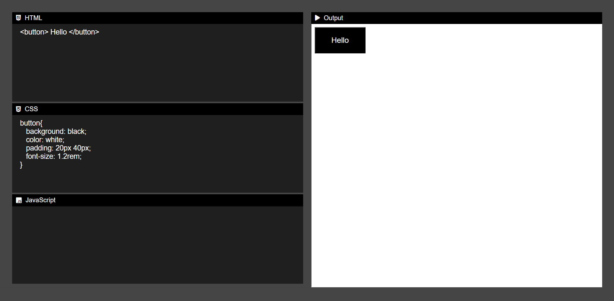

<h1 align="center">
  Code Editor
</h1>

<h3 align="center">
  Web Application
</h3>

  

The "Code Editor" repository contains code for a web application that allows users to write, edit, and test code in real-time. The application is similar to popular code editors like CodePen and JSFiddle, and offers a range of features for developers and designers alike.  
The code in the repository is written primarily in HTML, CSS, and JavaScript, and uses a range of front-end tools and libraries to provide a rich and responsive user interface. Some of the tools and libraries used include jQuery, Ace Editor, and Bootstrap.  
Overall, the "Code Editor" repository offers a valuable resource for developers and designers who want to build their own web-based code editors, and provides a range of features and tools to support code editing, sharing, and collaboration.

  
<!-- ................................................................................................................................. -->

### Features
 
Following are some of the new features and learning encountered while creating this amazing project:

- <b>Real-time code editing and previewing:</b>  Users can write and edit code in the editor pane and see the changes reflected in real-time in the preview pane.
- <b>Multiple language support:</b>  The code editor supports multiple programming languages, including HTML, CSS, JavaScript, and more.
- <b>Code highlighting and auto-completion:</b>  The editor includes syntax highlighting and auto-completion for common programming constructs, making it easier for users to write code quickly and accurately.
- <b>Code sharing and collaboration:</b>  Users can share their code with others and collaborate on projects in real-time.
- <b>User-friendly interface:</b>  The interface is designed to be intuitive and user-friendly, with clear labeling and easy-to-use controls.
- <b>Customizable layout:</b>  Users can customize the layout of the editor pane and preview pane to suit their preferences.
- <b>Error highlighting and debugging:</b>  The editor highlights syntax errors and other issues in the code, making it easier for users to identify and fix problems.
- <b>Responsive design:</b>  The editor is designed to be responsive and mobile-friendly, allowing users to edit and test code on a range of devices.
- <b>Code history and revision control:</b>  The editor includes features for tracking code revisions and history, allowing users to revert to previous versions of their code if necessary.
- <b>Integration with external libraries and APIs:</b>  The editor can be integrated with external libraries and APIs to provide additional functionality and features.
- <b>Potential for customization and expansion:</b>  The code editor can be customized and expanded with additional functionality to meet the specific needs of users and projects.

  
<!-- ................................................................................................................................. -->

### Resources
 
Follwing resources have been used in maintaining this project:

- [Fonts Awesome](https://fontawesome.com/search?q=play&o=r)

  
<!-- ................................................................................................................................. -->

### Demo

  The Demo of this working project can be found on  
  <a href="https://rebrand.ly/CodeEditor_MABCORP">rebrand.ly/CodeEditor_MABCORP</a>

  
<!-- ................................................................................................................................. -->

### Video

You can exclusively watch the video on this project from the making to deploying on my     channel with the link given below 

  [Video Link](# )  

  If you like my video then do Like the Video and share it with others.

  
<!-- ................................................................................................................................. -->

### Application Interface

  
<!-- ................................................................................................................................. -->

### Technology Stack
 
Follwing technologies have been used at the core of this application to make it stand in the market place:

- HTML
- CSS
- JavaScript

  
<!-- ................................................................................................................................. -->

### Advancement

> Not Recommended Yet

  
<!-- ................................................................................................................................. -->

### Deployment Details

The website is deployed using the free hosting provided by **Vercel**

  

  
Later on the link was customized using the well-known URL shortener and customizer **Rebrandly**:  

  

  
<!-- ................................................................................................................................. -->

### Developer

Muhammad Abdullah Butt  
abdullahbutt12292210@gmail.com  
> [Instagram](https://www.instagram.com/abdullah.butt.22/) 
> [FaceBook](https://www.facebook.com/profile.php?id=100076291614529) 
> [YouTube](https://www.youtube.com/channel/UCnuOFQyMywg-KuoN-lmav1Q) 
> [Portfolio](https://rebrand.ly/MuhammadAbdullahButt_MABCORP) 
> [Project Displayer]( https://rebrand.ly/ProjectDisplayer_MABCORP)
  
<!-- ................................................................................................................................. -->

